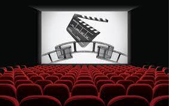

# **Cinema app**

## **Contents**
1. [Description](#Description)
2. [Features](#Features)
3. [Project structure](#Project-structure)
4. [Technologies](#Technologies)
5. [How to run project](#How-to-run-project)
____

## **Description**

This is simple implementation of real cinema app 

[:arrow_up:Contents](#Contents)
____

## **Features**

When you enter the site, you will be a guest and you will have access to such services:
* Login
* Register

When you log in as a `USER`, you will be able to do this actions:
* See all information of movies, cinema halls and movies sessions
* Add a ticket to the shopping cart
* Create order
* See order history
* Logout

When you log in as a `ADMIN`, you will be able to do this actions:
* See all information of movies, cinema halls and movies sessions
* Create, modify and delete cinema-hall, movies, and movie sessions from the database
* Get info about user by email
* Logout

[:arrow_up:Contents](#Contents)
____

## **Project structure**

### Project built on 3-tier architecture:
1. Data access layer (DAO).
2. Application layer (service).
3. Presentation layer (controllers).

Tables relation:

[:arrow_up:Contents](#Contents)
____

## **Technologies**

* Java version 11
* Spring core, security, web
* Hibernate
* Apache Tomcat (v9.0.50)
* MySQL
* Maven

[:arrow_up:Contents](#Contents)
____

## **How to run project**

### Tools to run project:
* IntelliJ Idea Ultimate
* Apache Tomcat (v9.0.50)
* MySQL

### How to run
1. Clone this project
2. Add new configuration TomCat Local server
3. Change username and password in db.properties
4. Create schema in MySQL

### After running the application you can log in as: 
* ADMIN (username: admin@i.ua, password: admin123)
* USER (username: user@i.ua, password: 123456789)
